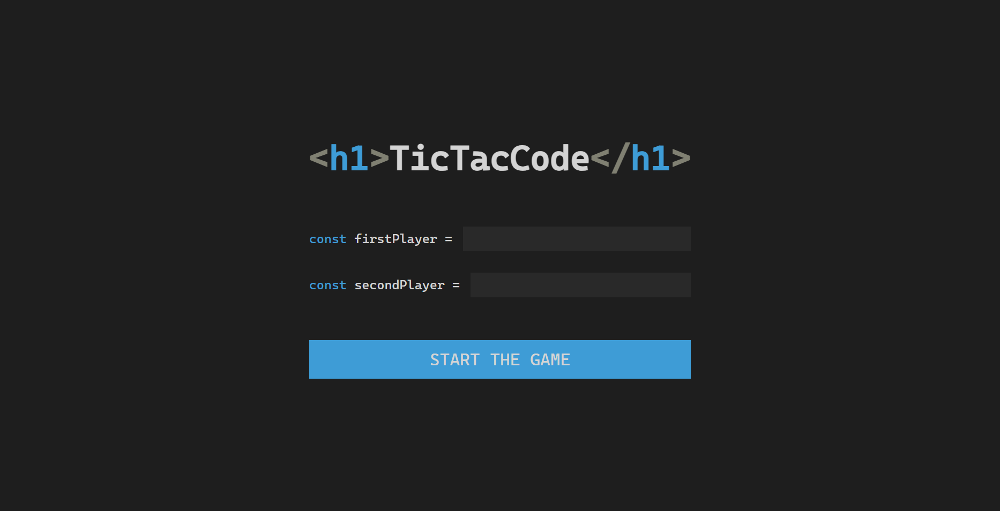
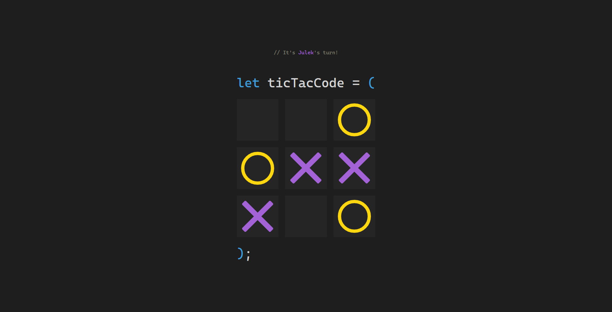

# Tic-Tac-Code

Welcome to **Tic-Tac-Code**, a modern and interactive twist on the classic Tic-Tac-Toe game. This web application allows two players to compete in a visually appealing and responsive environment, with features like dynamic animations and customizable player names.

## Features

- **Two-player mode**: Enter player names and compete in real-time.
- **Dynamic animations**: Smooth transitions for X and O marks.
- **Restart functionality**: Easily reset the game and start over.
- **Win tracking**: Keeps track of player victories during the session.

## Technologies Used

- **HTML5** for structure.
- **CSS3** for styling, including animations and custom fonts.
- **JavaScript** for game logic and interactivity.

## Screenshot




## How to Play

1. Clone the repository:
   ```bash
   git clone https://github.com/your-username/Tic-Tac-Code.git
   ```
2. Navigate to the project directory:
   ```bash
   cd Tic-Tac-Code
   ```
3. Open `index.html` in your browser to start the game.
4. Enter player names and click "Start the game."
5. Take turns clicking on the gameboard to place your marks (X or O).
6. The game will announce the winner or a draw. Click "Restart" to play again.

## Future Improvements

- Add AI for single-player mode.
- Implement persistent win tracking using local storage or a database.
- Enhance accessibility features for better usability.

## License

This project is licensed under the MIT License. Feel free to use and modify it as needed.